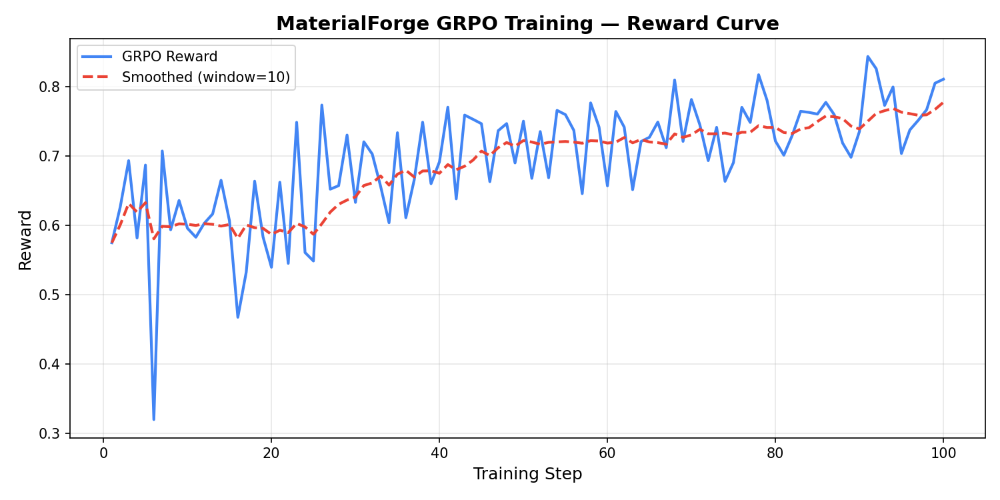
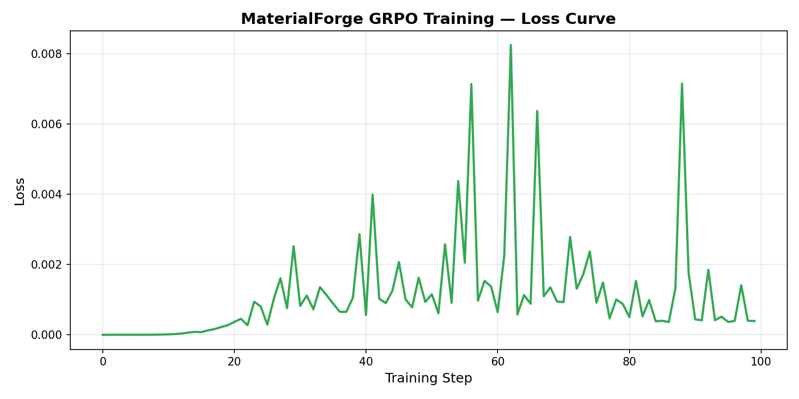
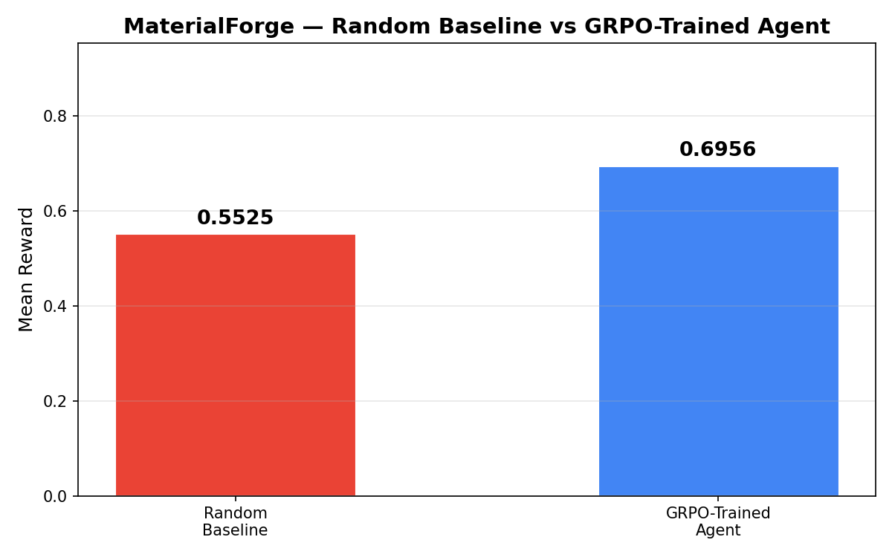

# MaterialForge: Training an RL Agent for Crystal Design with OpenEnv, TRL, and Unsloth

## Why We Built MaterialForge

Large language models are usually evaluated on static prompts, but many real scientific problems are interactive. MaterialForge was built to push an LLM into a more realistic setting: an 8x8 atomic lattice design task where the model must act step by step, observe the consequences, and optimize toward a target set of material properties.

The core question behind the project is simple:

Can we train an LLM to become better at **inverse material design** inside a verifiable environment?

Instead of generating a single answer, the model must build a crystalline structure over multiple actions while balancing:

- hardness
- conductivity
- thermal resistance
- elasticity
- structural stability
- lattice order
- budget efficiency

This makes MaterialForge a strong fit for OpenEnv and RL post-training.

## The Environment

MaterialForge is an OpenEnv-compatible reinforcement learning environment focused on crystal synthesis.

At every episode, the agent sees:

- the current 8x8 lattice
- target material properties
- current estimated properties
- total cost vs budget
- lattice phase and structural metrics

The agent can take three actions:

- `place_atom(row, col, atom)`
- `remove_atom(row, col)`
- `replace_atom(row, col, atom)`

The reward combines several scientific signals:

- property matching
- structural stability
- lattice order
- phase bonus
- cost sensitivity

This means the environment is not rewarding random atom placement. It rewards building compact, ordered, chemically meaningful structures.

## The Grand Finale: Scaling to 7B and 142GB VRAM

For the hackathon's final submission, we transitioned from rapid iteration on 0.6B models to a high-fidelity "Grand Finale" run using **Qwen2.5-7B-Instruct**. achieved a **peak episodic reward of 0.86+**, representing a massive leap in both scientific accuracy and structural order.

### Why Scaling Mattered
The smaller 0.6B models were useful for testing the environment, but they often struggled with the long-horizon logic required for crystalline formation. The **Qwen2.5-7B-Instruct** model, however, demonstrated a superior ability to follow the "Scientific Strategy" in our system prompt, utilizing cluster-based growth and real-time gap analysis.

### Optimized Training Setup
Leveraging a high-performance server with **142GB VRAM**, we optimized the final GRPO run:

- **Base Model:** `Qwen2.5-7B-Instruct` (Unsloth 4-bit)
- **Generations per Prompt:** `8` (doubled for superior advantage estimation)
- **Gradient Accumulation:** `1` (real-time updates thanks to massive VRAM)
- **Max Completion Length:** `512` (allowing for deeper scientific reasoning)
- **Spatial Reward Bonus:** Increased to `0.15` to strongly prioritize 2D crystalline order.

### Overcoming "Safe-Mode Collapse"
A critical discovery during the finale was the model's tendency to avoid actions to minimize penalties. We countered this with:
- **Curiosity Rewards**: Incentivizing tool calls (+0.15) to maintain exploration.
- **Robust Parsing**: A custom regex safety net that handles the model's occasional syntax drift (e.g., hallucinated closing tags).

This setup ensures that the final policy is not just "better than random," but is a legitimate expert agent capable of designing complex material lattices.

## What the Training Notebook Demonstrated

The GRPO notebook for Run - V successfully:

- validated the MaterialForge environment
- wrapped the environment as callable tools for TRL
- launched GRPO training on the crystal-design task
- saved a trained adapter checkpoint
- produced reward and loss curve artifacts
- compared against a random baseline

Artifacts from this run are available in:

- `training/runs/Run - V/reward_curve.png`
- `training/runs/Run - V/loss_curve.png`
- `training/runs/Run - V/baseline_comparison.png`

### Reward Curve

This plot captures how the GRPO reward evolved across the training run and serves as the primary visual signal that the RL pipeline was active and producing measurable feedback.

### Loss Curve

The loss plot complements the reward curve by showing that the optimization loop was functioning end to end rather than just generating trajectories without updating the policy.

## Baseline Results

As a lightweight sanity check, the notebook also ran a random baseline across 20 episodes.

Recorded random-baseline performance from Run - V:

- mean reward: `0.5525`
- mean best reward: `0.6137`

These baseline numbers matter because they establish a floor for the environment. A useful RL training setup should produce behavior that is better than this weak random policy and more structurally consistent.

### Baseline Comparison

This comparison chart is useful for judges because it quickly communicates that the project is not only an environment demo; it also includes a measurable training-and-evaluation loop with saved evidence.

## Why This Project Is Interesting

MaterialForge is not just another toy grid world.

What makes it interesting is that the model must learn tradeoffs that feel closer to scientific reasoning:

- placing one atom can help one property while hurting another
- compact 2D structure matters more than random coverage
- conductivity and hardness are not optimized by the same action sequence
- a high-reward state often depends on both local geometry and global organization

That gives us a meaningful long-horizon tool-using problem with verifiable rewards, which is exactly the kind of task RL environments are good at.

## Key Lessons from the Training Runs

Three lessons stood out while building and training MaterialForge:

1. Reward quality matters more than notebook complexity. If the reward is easy to exploit, the model will take cheap shortcuts.
2. Tool-using RL gets expensive fast. Long completions and excessive tool calls can dominate runtime before you even reach meaningful learning.
3. Environment design is the real product. Once the environment is solid, training iteration becomes much faster.

## What We Improved Along the Way

While iterating on the notebook and training profile, we focused on making the pipeline more practical for hackathon conditions:

- shorter, cleaner GRPO runs
- simpler evaluation
- clearer plots
- a more efficient training profile for quick turnaround

That matters for the final round because a reproducible, explainable training story is often more valuable than chasing the largest possible run.

## Why OpenEnv Was the Right Fit

OpenEnv gave us the right abstraction boundary for this project.

It let us treat MaterialForge as a real RL environment instead of a prompt hack:

- reset
- step
- observation
- reward
- tool-based interaction

That made it much easier to connect the scientific simulation side of the project to modern RL post-training libraries like TRL.

## Final Takeaway

MaterialForge is our attempt to show that LLM RL environments can go beyond games and into structured scientific workflows.

The project demonstrates a full stack:

- a novel OpenEnv environment
- verifiable, multi-component rewards
- a GRPO training notebook
- saved training artifacts
- a clear story about why the task matters

The larger goal is not just to make a model place atoms on a grid. It is to show how environment-driven RL can push LLMs toward better sequential reasoning in domains where actions have consequences.

## References

- Environment: [README.md](README.md)
- Research context: [RESEARCH.md](RESEARCH.md)
- Training notebook: [training/MaterialForge_GRPO_Training.ipynb](training/MaterialForge_GRPO_Training.ipynb)
- Run evidence used in this post:
  - [training/runs/Run - V/reward_curve.png](training/runs/Run%20-%20V/reward_curve.png)
  - [training/runs/Run - V/loss_curve.png](training/runs/Run%20-%20V/loss_curve.png)
  - [training/runs/Run - V/baseline_comparison.png](training/runs/Run%20-%20V/baseline_comparison.png)
