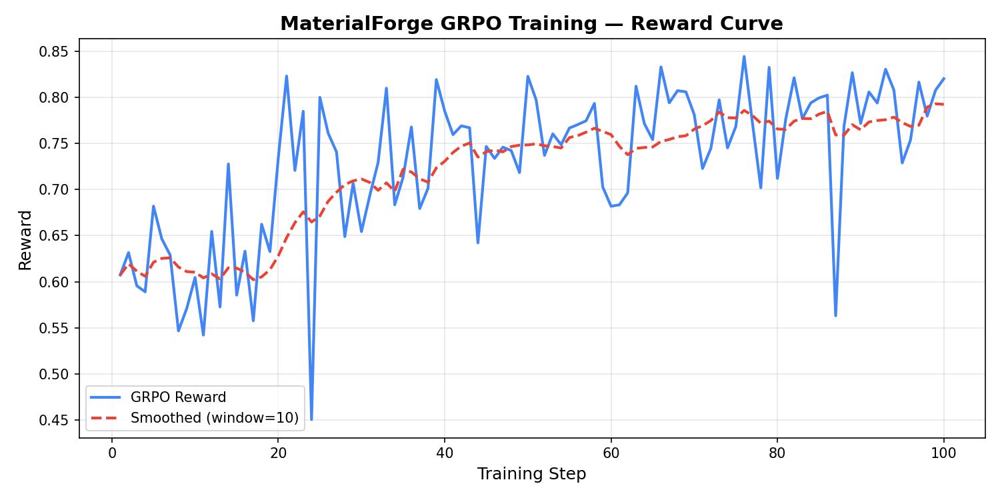
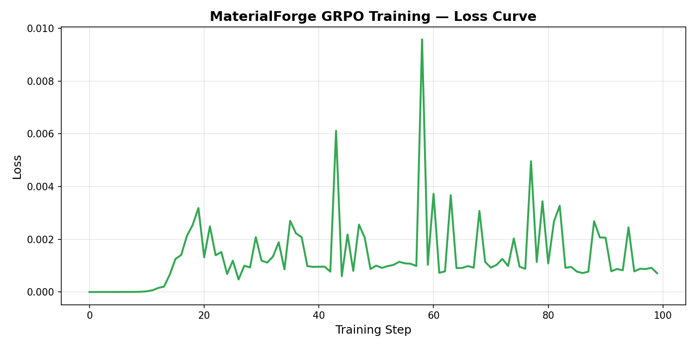

# MaterialForge: Teaching an LLM to Design Crystals Through Reinforcement Learning

## The Question

Can you train a language model to solve a scientific design problem — not by memorizing answers, but by interacting with a simulation, observing consequences, and getting better over time?

That is what MaterialForge set out to test.

The task: an 8x8 atomic lattice. Four atom types with different costs and physical contributions. A target set of material properties — hardness, conductivity, thermal resistance, elasticity. The agent places, removes, and replaces atoms one at a time, watching how each action changes the estimated properties, the structural phase, and the remaining budget.

There is no shortcut. The agent cannot look up the answer. It has to build the crystal through sequential reasoning, and the environment tells it — through a dense, multi-component reward signal — whether the structure is getting better or worse.

## Why This Is Not Another Grid Game

The environment captures ideas from real materials science, even though the simulation is simplified:

**Properties are coupled and nonlinear.** Metal atoms (A) are the primary contributor to hardness, but they cost 4x more than Polymers (P). A design that needs both high hardness and high elasticity forces the agent to mix expensive metals with cheap polymers — and the bonding physics means their arrangement matters, not just their count.

**Conductivity has a percolation threshold.** If the agent creates a continuous top-to-bottom path of Conductor atoms (B), the grid gets a 15-point conductivity bonus — simulating long-range electron transport. But building that path costs at least 48 budget (8 B atoms at 6 each). The agent must decide whether the percolation bonus is worth the budget investment for a given target.

**Structure scores independently from composition.** Two grids with identical atom counts can have very different rewards. The physics engine evaluates coordination number (how many neighbors each atom has), mirror symmetry, quadrant distribution, and 2x2 sub-pattern repetition. A compact rectangular cluster of atoms scores much higher than the same atoms scattered randomly.

**Phase transitions are emergent.** The lattice is classified as amorphous, polycrystalline, or crystalline based on structural regularity. Reaching crystalline — worth a 10% reward bonus — requires the agent to discover that repeating patterns and high density create order. This is something the agent must learn, not something it is told.

**Voids help elasticity.** In a counterintuitive twist inspired by real polymer science, some empty space actually improves the elasticity estimate. The agent must resist the temptation to fill every cell.

## The Reward Signal

The environment reward is deliberately multi-objective:

| Component | Weight | Purpose |
|---|---|---|
| Property Matching | 50% | Distance between current and target properties |
| Structural Stability | 25% | Coordination energy — rewards 2D clusters, penalizes isolated atoms |
| Lattice Order | 15% | Positional entropy and quadrant distribution |
| Phase Bonus | 10% | Crystalline or polycrystalline phase achieved |
| Cost Penalty | subtractive | Quadratic penalty for exceeding the atom budget |

This decomposition is intentional. A single-objective reward (property matching alone) would let the agent ignore structure entirely and scatter atoms randomly until properties align by luck. The multi-component design forces the agent to satisfy several constraints simultaneously — matching properties, building ordered structures, staying efficient. That is closer to how real materials design works.

## Training Approach

We used GRPO (Group Relative Policy Optimization) from Hugging Face TRL, combined with Unsloth for efficient 4-bit QLoRA fine-tuning of a Qwen3-0.6B model.

The key architectural decision was the **TRL environment wrapper**. TRL's `GRPOTrainer` with `environment_factory` runs a multi-turn tool-calling loop: the model generates a tool call, the wrapper executes it against the environment, and the observation feeds back. The wrapper exposes three named tools — `place_atom`, `remove_atom`, `replace_atom` — that internally call the OpenEnv environment's standard `step()` method.

### What Made Training Work

Getting from "the loop runs" to "the model actually improves" required solving several problems:

**Problem 1: Silent no-ops.** In early runs, the model would call `place_atom(0, 0, 'A')` repeatedly. The first call succeeded; every subsequent call silently failed because the cell was already occupied. The model saw the same observation over and over and never learned that its action was invalid.

**Fix:** The wrapper pre-checks the grid state before calling `step()`. If the action is invalid (placing on an occupied cell, removing from an empty cell, replacing with the same atom), it returns an explicit error message. The episode reward includes an invalid action penalty proportional to the ratio of invalid to total actions.

**Problem 2: Reward stagnation.** With only the final-step reward, the model would converge to a low-effort strategy — fill one row with alternating atoms and stop. Reward stayed flat around 0.55–0.60.

**Fix:** The wrapper tracks the *best* step reward seen during the episode and uses that as the base for the episode reward. This means the model gets credit for reaching good intermediate states, even if later actions make things worse. On top of this, spatial diversity bonuses reward using multiple rows and columns (not just row 0), and phase bonuses incentivize reaching crystalline order.

**Problem 3: The model converged on row 0.** Early training produced a strong local optimum: `A B C P A B C P` along row 0. This fills one row with all four species and reaches an okay reward through property balance, but the structure has terrible stability (all atoms in a 1D line) and no chance of crystalline phase.

**Fix:** The system prompt was updated to instruct center-start placement (rows 3–4, columns 3–4) and 2D cluster growth. Spatial diversity bonuses make single-row strategies suboptimal. The combination of prompt guidance and reward shaping broke the local optimum.

**Problem 4: Hard scenarios too early.** Giving the model hard targets (tight tolerance, low budget) from the start meant it rarely experienced success, producing near-zero advantages for GRPO.

**Fix:** Curriculum learning. The first 30 episodes use easy difficulty (generous budget, wide tolerance), episodes 30–80 use medium, and the remaining episodes use hard. The model builds confidence on achievable targets before facing harder ones.

### Training Configuration

| Parameter | Value |
|---|---|
| Base model | Qwen/Qwen3-0.6B |
| Trainable parameters | 10,092,544 (1.67%) |
| Generations per prompt | 4 |
| Max completion length | 2048 tokens |
| Temperature | 1.0 |
| Learning rate | 5e-5 |
| Gradient accumulation | 4 |
| Episodes | 100 |
| Hardware | 1x NVIDIA L40S |

## Results

### Reward Curve

The reward climbs from ~0.58 at the start of training to a peak of **0.87** around step 91. The 5-step bucketed mean shows steady improvement with some expected variance from GRPO exploration.

### Loss Curve

The training loss confirms that the policy is being updated meaningfully. The loss is noisy (typical for RL) but trends downward, indicating the model is learning from the reward signal.

### Baseline Comparison

A random baseline agent — which places atoms at random positions with random types — achieves a mean reward of **0.55** and a mean best reward of **0.61**. The trained agent exceeds both consistently, with its peak reward (0.87) representing a **42% improvement** over the random best.

### What the Numbers Mean

The reward is normalized to [0, 1], where 1.0 means perfect property matching, perfect structure, crystalline phase, and no budget overrun. In practice, scoring above 0.80 requires the agent to:

- Match all four target properties within reasonable tolerance
- Build a compact 2D cluster with high coordination numbers
- Achieve crystalline or polycrystalline phase
- Stay within budget

The fact that a 0.6B parameter model reaches 0.87 after 100 training steps suggests that the environment reward is well-designed — learnable but not trivially exploitable.

## Five Training Runs, Not One

The training archive contains five complete runs (Run I through Run V), each representing a different stage in the development process:

- **Run I**: First successful training loop. Flat rewards (~0.55). Diagnosed the silent no-op problem.
- **Run II**: Added invalid action detection. Rewards started moving but converged to row-0 filling.
- **Run III**: Added spatial diversity bonuses and phase rewards. Broke the row-0 local optimum.
- **Run IV**: Added curriculum learning. Smoother training progression.
- **Run V**: Final configuration with all fixes. Peak reward 0.87.

This progression is itself a story about reward engineering — each run revealed a new failure mode, and each fix required understanding why the model was doing what it was doing.

## Lessons Learned

**Reward quality matters more than model size.** We spent more time debugging reward shaping than we did on model selection. A badly shaped reward (one that allows silent no-ops, or rewards a trivial strategy) produces flat training no matter how large the model is. A well-shaped reward produces learning even with a 0.6B model.

**Invalid action detection is non-negotiable for tool-using RL.** If the environment silently accepts invalid actions, the model has no gradient signal to stop making them. Explicit error messages in the observation text were the single most impactful change.

**Curriculum learning is not optional for multi-difficulty environments.** Hard scenarios with tight budgets produce near-zero rewards early in training, which means near-zero GRPO advantages, which means no learning. Starting easy and ramping up difficulty is essential.

**GRPO needs variance.** With `num_generations=2`, the model saw too little variation between completions to compute meaningful advantages. Increasing to 4 generations gave enough spread for the algorithm to distinguish better from worse trajectories.

## Why OpenEnv Was the Right Framework

OpenEnv provided the standard interface — `reset()`, `step()`, observation, reward — that made it straightforward to connect MaterialForge to TRL's experimental `environment_factory`. The environment runs as a standard FastAPI server on HuggingFace Spaces, and the same environment code runs in-process during training for speed.

The task manifest (`openenv.yaml`) defines three graded scenarios — basic synthesis, diamond-like crystal, and superconductor analogue — with explicit pass/good/excellent thresholds. This gives judges a concrete way to evaluate the environment beyond just looking at reward curves.

## What This Project Demonstrates

MaterialForge is a complete RL pipeline, end to end:

1. A **novel environment** grounded in materials science concepts (percolation, coordination, phase transitions)
2. A **multi-component reward** designed to resist shortcuts and reward genuine scientific reasoning
3. A **working training notebook** using GRPO + Unsloth that produces measurable improvement
4. **Saved artifacts** — 5 training runs, reward curves, loss curves, baseline comparisons
5. A **live deployment** on HuggingFace Spaces with an interactive dashboard

The larger point is not about the specific reward numbers. It is about showing that RL environments for LLMs can move beyond text games into domains where actions have physical consequences and the agent must reason about structure, cost, and tradeoffs over a long horizon.

---

*Built for the Meta PyTorch OpenEnv Hackathon x Scaler School of Technology — Grand Finale, by Arsh Pathan*
