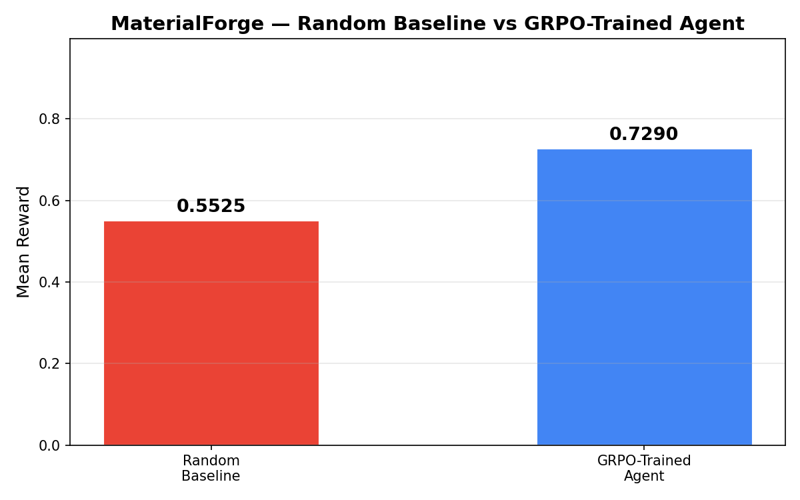

# MaterialForge

**An RL Environment for Inverse Crystal Design on an Atomic Lattice**

[](https://openenv.org/)
[](https://www.python.org/)
[](https://www.docker.com/)
[](LICENSE)

MaterialForge is an OpenEnv-compatible reinforcement learning environment where an LLM agent designs crystalline structures step by step on an 8x8 atomic lattice. The agent must match target physical properties — hardness, conductivity, thermal resistance, and elasticity — while managing a finite atom budget and building structurally stable, ordered configurations.

This is not a toy grid task. The agent faces real tradeoffs: placing one atom can improve conductivity but hurt elasticity, a compact cluster scores better than scattered atoms, and exceeding budget means the design fails. Every action has downstream consequences that the agent must learn to anticipate.

| | |
|---|---|
| **Live Environment** | [huggingface.co/spaces/ArshPathan/material_forge_env](https://huggingface.co/spaces/ArshPathan/material_forge_env) |
| **Interactive Dashboard** | [material_forge_env/playground](https://arshpathan-material-forge-env.hf.space/) |
| **Training Blog** | [BLOG.md](https://huggingface.co/spaces/ArshPathan/material_forge_env/blob/main/BLOG.md) |
| **Training Notebook** | [training/MaterialForge_GRPO_Training.ipynb](https://colab.research.google.com/drive/1HI_tcYdvh-H_6pu7PZMhHCz0ggje4lF3?usp=sharing) |

## The Problem

Given target values for four material properties, can an LLM learn to construct a crystal lattice that matches them?

The agent cannot solve this in one shot. Each episode is a multi-step design session where the agent must:

1. Read the current lattice state and property gaps
2. Choose which atom to place, where, and why
3. Observe how the action changes estimated properties
4. Correct mistakes — remove atoms that overshoot, replace wrong species
5. Build toward a structurally ordered, phase-stable configuration
6. Stay within the cost budget

This makes it a **long-horizon planning** problem with **verifiable rewards** — exactly the kind of task where RL post-training can make a measurable difference.

## Why This Environment Is Novel

Most RL environments for LLMs involve text games, code generation, or math problems. MaterialForge puts the agent in a **scientific design workflow** where:

- **Properties are coupled.** Atom A boosts hardness but costs 4x more than atom P. Placing conductors (B) in a percolation pathway gives a 15-point bonus, but only if the path spans the full grid. The agent must reason about these interactions.

- **Structure matters, not just composition.** Two lattices with identical atom counts can have very different rewards. A compact 4x4 block of atoms scores higher on stability than the same atoms scattered across the grid. The physics engine rewards coordination number, mirror symmetry, and quadrant distribution.

- **Phase transitions create natural curricula.** The lattice can be amorphous, polycrystalline, or crystalline. Reaching crystalline requires repeating 2x2 sub-patterns across the grid — a structural regularity the agent must discover through exploration, not memorization.

- **Budget forces efficiency.** Each atom has a different cost (Metal=8, Conductor=6, Ceramic=4, Polymer=2). The agent cannot just fill the grid — it must allocate resources strategically. This mirrors real materials science where exotic atoms are expensive.

## How It Works

### Observation Space

At each step, the agent sees:

| Field | What it tells the agent |
|---|---|
| `grid` | 8x8 lattice — each cell is `A`, `B`, `C`, `P`, or `.` (empty) |
| `target` | Goal values for hardness, conductivity, thermal resistance, elasticity (0–100) |
| `current_properties` | Estimated properties of the current lattice |
| `phase` | Crystal phase: amorphous, polycrystalline, or crystalline |
| `total_cost` / `cost_budget` | How much has been spent vs. how much is allowed |
| `score_breakdown` | Structural stability and lattice order sub-scores |

### Action Space

| Tool | What it does |
|---|---|
| `place_atom(row, col, atom)` | Place a new atom on an empty cell |
| `remove_atom(row, col)` | Remove an atom, freeing budget |
| `replace_atom(row, col, atom)` | Swap one species for another |

### Atom Types

| Symbol | Role | Primary Property | Cost |
|---|---|---|---|
| `A` | Metal | Hardness | 8 |
| `B` | Conductor | Conductivity | 6 |
| `C` | Ceramic | Thermal Resistance | 4 |
| `P` | Polymer | Elasticity | 2 |

## Reward Design

The reward is a dense, multi-component signal designed to be scientifically meaningful and resistant to shortcuts:

| Component | Weight | What it measures |
|---|---|---|
| Property Matching | 50% | How close current properties are to the target vector |
| Structural Stability | 25% | Coordination energy — penalizes isolated atoms and 1D chains, rewards 2D clusters |
| Lattice Order | 15% | Positional entropy — rewards periodic arrangements and even quadrant distribution |
| Phase Bonus | 10% | Reaching crystalline or polycrystalline phase |
| Cost Penalty | negative | Quadratic penalty for exceeding the atom budget |

All components are normalized to [0, 1]. The final reward is `min(max(composite, 0), 1)`.

This decomposition means the agent cannot get a high reward by optimizing only one axis. A grid that matches properties perfectly but has terrible structure scores ~0.50. A beautifully ordered grid that ignores the target properties also scores ~0.40. The agent must satisfy all objectives simultaneously.

## The Physics Engine

MaterialForge's physics engine (`environment/physics.py`) computes properties through several mechanisms:

- **Base contributions**: Each atom type contributes to all four properties with different weights (e.g., Metal contributes 1.0 to hardness but only 0.05 to elasticity)
- **Bonding bonuses**: Same-type neighbors amplify contributions — clustering matters
- **Percolation pathways**: A continuous path of conductor atoms (B) spanning top-to-bottom adds a large conductivity bonus, simulating long-range electron transport
- **Density scaling**: Higher grid occupancy generally strengthens all properties
- **Elasticity voids**: Some empty space actually helps elasticity, creating a design tension between filling the grid (good for other properties) and leaving gaps (good for flexibility)

Phase classification uses 2x2 sub-pattern analysis and row/column periodicity to determine crystalline order.

Structural stability combines coordination energy (penalizes cn=0,1; rewards cn≥3) with mirror-plane symmetry.

## Training

We trained using GRPO (Group Relative Policy Optimization) with TRL and Unsloth 4-bit QLoRA.

### Training Setup (Run V)

| Parameter | Value |
|---|---|
| Base model | Qwen/Qwen3-0.6B |
| Trainable parameters | 10,092,544 (1.67% of 606M) |
| Training method | GRPO with tool-calling |
| Generations per prompt | 4 |
| Max completion length | 2048 tokens |
| Learning rate | 5e-5 |
| Episodes | 100 |
| Hardware | 1x NVIDIA L40S |

### What We Built Into the Training Wrapper

The TRL wrapper (`training/train_env_wrapper.py`) adds several training-specific features on top of the base environment:

- **Invalid action detection**: Pre-checks grid state before calling `step()`. Placing on an occupied cell returns an explicit error message instead of a silent no-op. This was critical — without it, the model would repeat the same invalid action indefinitely and never learn.

- **Curriculum learning**: Episodes start easy (generous budget, wide tolerance) and progress to medium and hard difficulty as training advances. This prevents the model from giving up on hard targets early in training.

- **Shaped episode reward**: The final reward combines the best step reward with bonuses for spatial diversity (using multiple rows and columns) and phase quality, minus penalties for invalid actions, excessive tool calls, and stagnation.

- **Early stopping**: Episodes end early when the agent reaches reward ≥0.94 with good phase, or when it stagnates for 10+ steps with no improvement. This keeps training efficient.

### Results

Over 100 training steps, the policy improved from a baseline reward of ~0.55 to a peak of **0.87**:

**Reward Curve**


**Loss Curve**


**Baseline Comparison**



The random baseline mean reward is **0.55**, and the random best reward is **0.61**. The trained agent consistently exceeds both.

The training archive contains 5 completed runs showing the iteration process — from initial flat rewards (Run I) through reward shaping improvements to the final Run V results.

## Architecture

```
Training Notebook / Inference Agent
    → TRL tool-calling wrapper (place_atom, remove_atom, replace_atom)
        → MaterialForgeEnvironment.step()
            → Lattice state update
            → Physics engine (property estimation, phase classification)
            → HeuristicRewardRubric (multi-component reward)
        ← MaterialForgeObservation (grid, properties, reward, phase)
    ← Text observation for LLM

FastAPI Server (server/app.py)
    → OpenEnv-compatible HTTP API (reset, step, state)
    → Interactive dashboard (server/static/)
```

## Project Structure

```
MaterialForge/
├── environment/
│   ├── config.py          # Grid size, atom types, difficulty presets
│   ├── lattice.py         # 8x8 grid state management
│   ├── physics.py         # Property estimation, phase classification, stability
│   └── rubrics.py         # Multi-component reward calculation
├── scenarios/
│   └── scenarios.py       # Target property generation per difficulty
├── server/
│   ├── app.py             # FastAPI server with OpenEnv endpoints
│   ├── material_forge_env_environment.py  # OpenEnv environment wrapper
│   └── static/            # Interactive dashboard
├── training/
│   ├── MaterialForge_GRPO_Training.ipynb  # GRPO training notebook
│   ├── train_env_wrapper.py               # TRL-compatible wrapper
│   └── runs/              # Archived training runs (I through V)
├── models.py              # Action and observation data models
├── client.py              # Environment client
├── inference.py           # Baseline inference agent
├── openenv.yaml           # OpenEnv task manifest with 3 scenarios
├── BLOG.md                # Training write-up
├── Dockerfile             # Deployment image
└── pyproject.toml         # Project configuration
```

## Running It

### Docker (recommended)

```bash
docker build -t material-forge .
docker run -p 7860:7860 material-forge
```

### Local Development

```bash
uv sync
uv run server
```

### Inference Agent

```bash
export HF_TOKEN=your_token
uv run python inference.py
```

### Health Check

```bash
curl https://huggingface.co/spaces/ArshPathan/material_forge_env/health
```

## For Judges

Recommended review order:

1. **This README** — understand the environment and why it's interesting
2. **[Live Dashboard](https://huggingface.co/spaces/ArshPathan/material_forge_env)** — interact with the environment
3. **[BLOG.md](https://huggingface.co/spaces/ArshPathan/material_forge_env/blob/main/BLOG.md)** — the training story, results, and lessons learned
4. **[Training Notebook](https://colab.research.google.com/drive/1HI_tcYdvh-H_6pu7PZMhHCz0ggje4lF3?usp=sharing)** — the full GRPO pipeline
5. **`training/runs/Run - V/`** — reward curves, loss curves, baseline comparison

The `openenv.yaml` manifest defines three graded scenarios (basic synthesis, diamond-like, superconductor analogue) with pass/good/excellent thresholds and baseline performance numbers.

---

<div align="center">
Built for the <b>Meta PyTorch OpenEnv Hackathon x Scaler School of Technology</b> — Grand Finale
<br>
by Arsh Pathan
</div>
