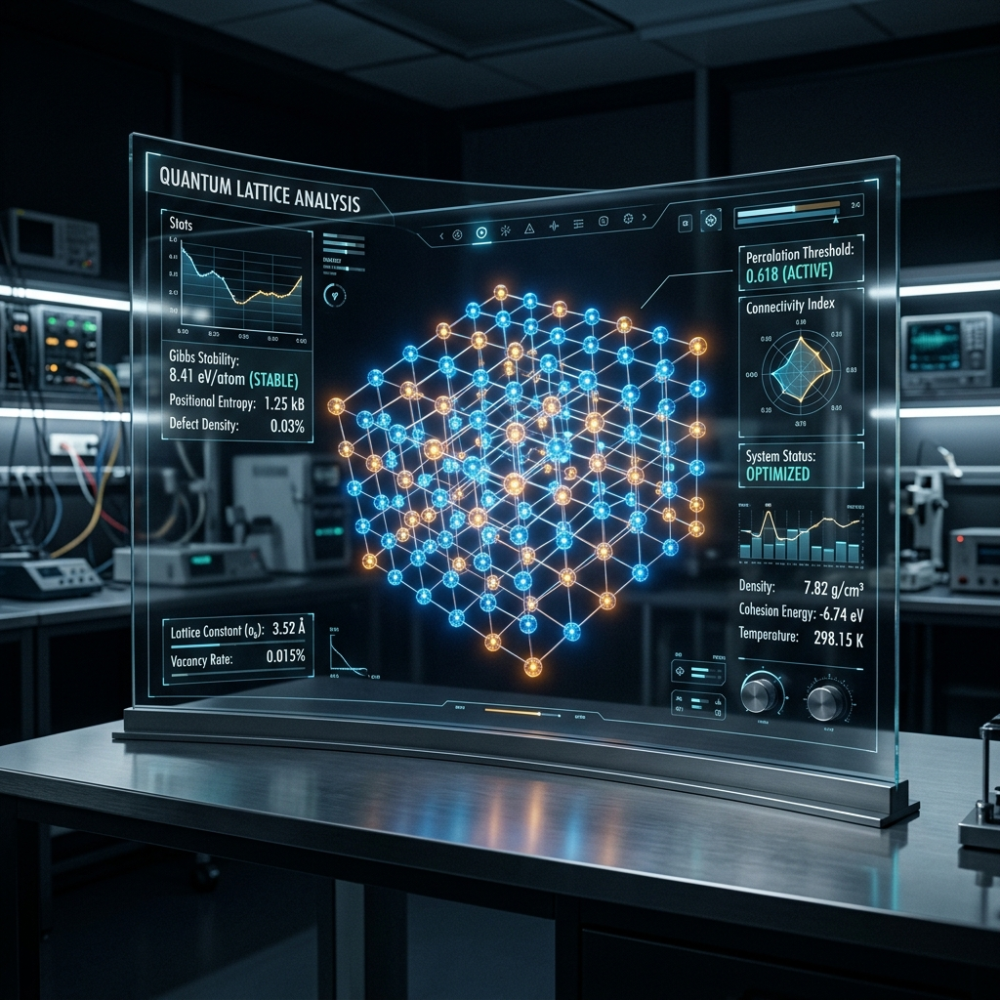
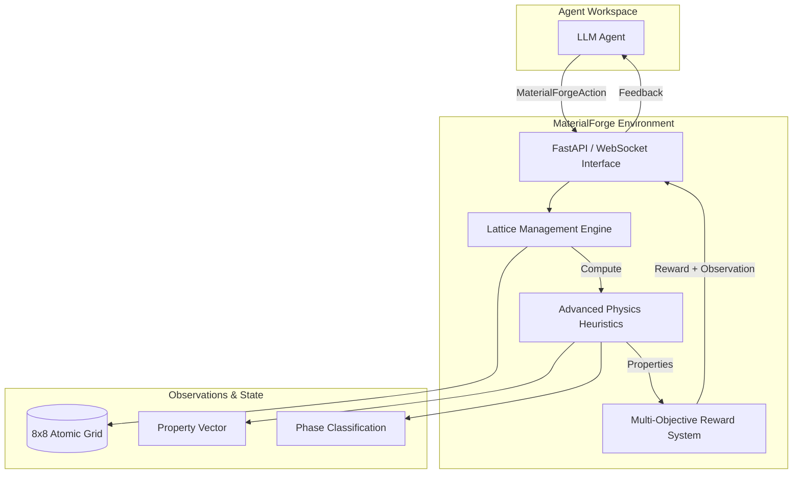
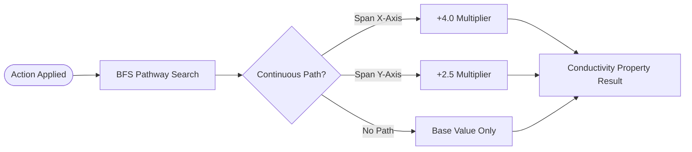
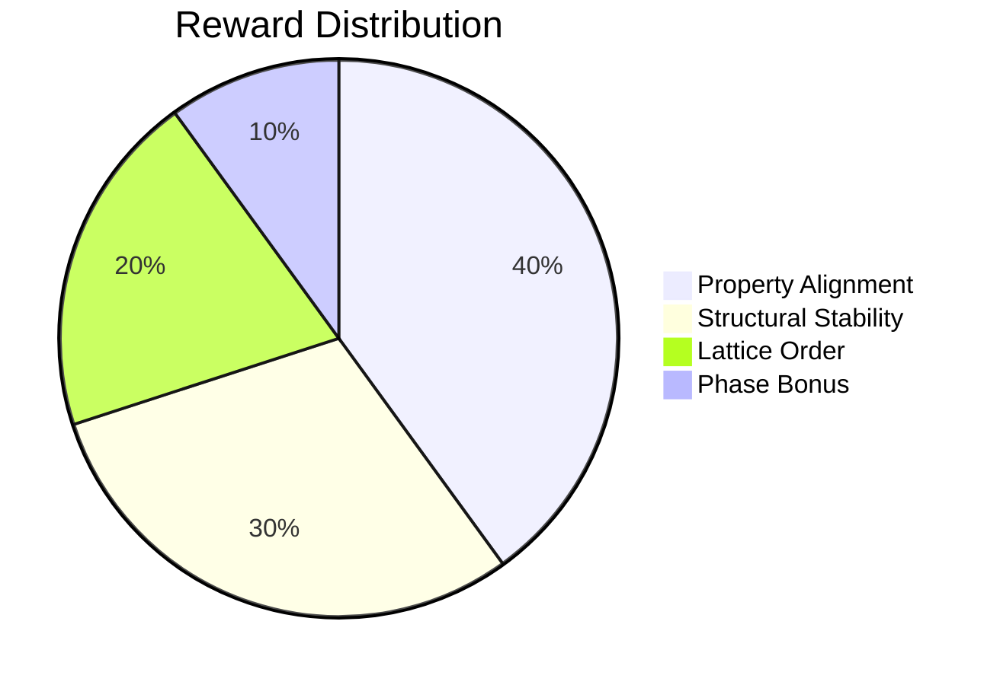

<div align="center">
  
  <h1>🔬 MaterialForge</h1>
  <p><b>An Advanced Reinforcement Learning Sandbox for Atomic Crystal Engineering</b></p>

[](https://github.com/meta-pytorch/openenv)
[](LICENSE)
[](#)

</div>

---

## 🏛️ Executive Summary

**MaterialForge** is a high-fidelity environment designed for the discovery of optimal crystal structures. It simulates the structure-property relationship of materials using advanced physics heuristics, challenging AI agents to evolve a lattice grid from an amorphous state into highly ordered crystalline structures that meet target thermal and electrical specifications.

---

## 🏗️ System Architecture

MaterialForge follows a decoupled architectural pattern, ensuring that pure-physics logic is separated from the interactive server and the RL-loop orchestration.



---

## 🧪 Scientific Foundations

The environment implements three primary physical models to simulate material behavior at a heuristic level.

### 1. Percolation & Conductivity

Conductivity is determined by the **Percolation Threshold**. The engine identifies connected pathways of Conductive Atoms (Species B) across the lattice.



### 2. Structural Stability (Gibbs Approach)

Stability is derived from local coordination numbers and mirror-plane symmetry.

- **Coordination bonding**: Rewards atoms with a higher local neighbor density.
- **Mirror Symmetry**: Symmetry across central axes stabilizes the lattice against thermal stress.

### 3. Lattice Order (Entropy)

Measures the **Positional Entropy** of atoms. Highly ordered crystalline structures (Symmetric and Homogeneous) yield the highest "Lattice Order Index".

---

## 📊 Interaction Model

### Action Space

Agents interact via discrete operations on the 8x8 lattice:

| Action    | Description                                     | Scientific Intent                   |
| :-------- | :---------------------------------------------- | :---------------------------------- |
| `place`   | Inserts an atom into an empty cell.             | Material Growth                     |
| `replace` | Swaps an existing atom for a different species. | Lattice Refinement                  |
| `remove`  | Clears a cell.                                  | Defect Management / Budget Recovery |

### Observation Space

The environment returns a rich state-vector containing:

- **Grid Snapshot**: Full 2D array representation.
- **Property Vector**: Current [Hardness, Conductivity, Thermal, Elasticity].
- **Score Breakdown**: Granular feedback on Stability and Order.

---

## 🏆 Scoring Rubric

The reward signal $R$ is calculated to incentivize scientific accuracy while enforcing material efficiency.



> [!IMPORTANT]
> **Quadratic Cost Pressure**: Every action incurs an atomic cost. If the total cost exceeds the budget, a **quadratic penalty** is applied: $Penalty = (Cost_{total} - Budget)^2$. This forces agents to build efficiently rather than filling the grid blindly.

---

## 🛠️ Developer Integration

### Quick Launch

```bash
# Install dependencies
uv sync

# Start the environment server
uv run server
```

### Interactive Playground

Access the high-fidelity laboratory dashboard at:
`http://localhost:8000/playground`

---

<div align="center">
  <p>Built with ❤️ by <b>Arsh Pathan</b> for the Meta PyTorch OpenEnv Hackathon</p>
  <a href="https://huggingface.co/spaces/ArshPathan/material_forge_env"><b>Launch Production Discovery Lab</b></a>
</div>
