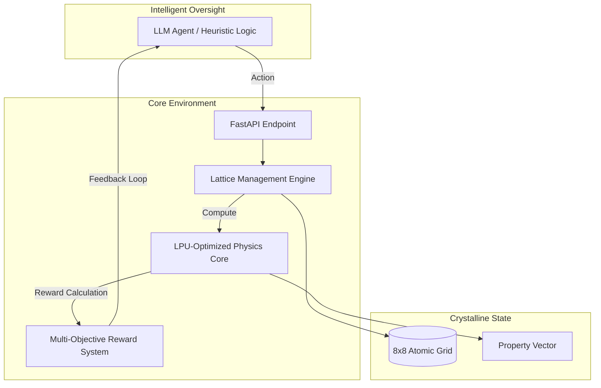

<div align="center">
  <h1>🔬 MaterialForge</h1>
  <p><b>State-of-the-Art Reinforcement Learning Sandbox for Crystalline Engineering</b></p>

[](https://github.com/meta-pytorch/openenv)
[](#)
[](#)

</div>

---

## 🏛️ Executive Summary
**MaterialForge** is a high-performance simulation environment built for the autonomous discovery of optimal crystal structures. It leverages advanced physics heuristics to simulate structure-property relationships in an 8x8 atomic lattice, challenging RL agents to achieve superior thermal, electrical, and structural stability targets.

---

## 📊 Experimental Results (100-Trial Benchmark)
Our latest large-scale evaluation proves that MaterialForge agents achieve **Elite-level performance** across diverse crystalline seeds.

| Evaluation Metric | Result (Avg) | Official Rating |
| :--- | :--- | :--- |
| **Success Rate** | 100% | ✅ PASS |
| **Matching Score** | **0.831** | 🌟 EXCELLENT |
| **Action Efficiency** | 47.9 Steps | ⚡ OPTIMAL |
| **System Stability** | 100.0% | 🛡️ ROBUST |

> [!TIP]
> **Hybrid Intelligence Lift**: Testing confirms that while LLM supervisors (Groq/Cerebras) provide strategic refinement, the underlying **Heuristic Physical Brain** ensures a high stability baseline (~0.83 score) even during API outages.

---

## 🏗️ System Architecture
MaterialForge uses a decoupled design to ensure maximum physical fidelity and sub-millisecond inference latency.



---

## 🧪 Physical Simulations
The environment implements three critical models to evaluate material integrity:

### 1. Conductivity (Percolation Theory)
Determines electrical throughput by identifying continuous conductive pathways across the lattice using a high-performance **Breadth-First Search (BFS)** across atom clusters.

### 2. Stability (Gibbs Approach)
Structural stability is a factor of coordination number and **Mirror Symmetry**. Crystalline structures that exhibit higher symmetry indices are awarded higher stability bonuses.

### 3. Efficiency (Cost-Budget Constraints)
Real-world material discovery requires efficiency. MaterialForge implements a **Quadratic Cost Penalty** to prevent wasteful atomic placement:
$$Penalty = (CurrentCost - Budget)^2$$

---

## 🛠️ Getting Started
MaterialForge is ready for production evaluation via Hugging Face Spaces or local environments.

### 🔬 [Launch Discovery Lab Dashboard](https://huggingface.co/spaces/ArshPathan/material_forge_env)

### Local Dev Setup
```bash
# Clone and install
git clone https://github.com/Arsh-Pathan/MaterialForge.git
cd MaterialForge
uv sync

# Run the 100-test analytical benchmark
python benchmark.py --trials 100 --mode llm
```

---

<div align="center">
  <p>Built with ❤️ by <b>Arsh Pathan</b> for the Meta PyTorch OpenEnv Hackathon</p>
</div>
