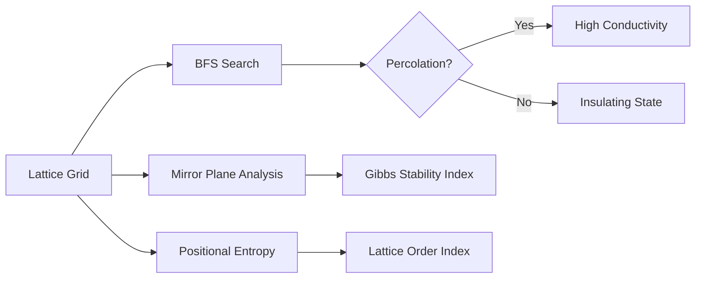
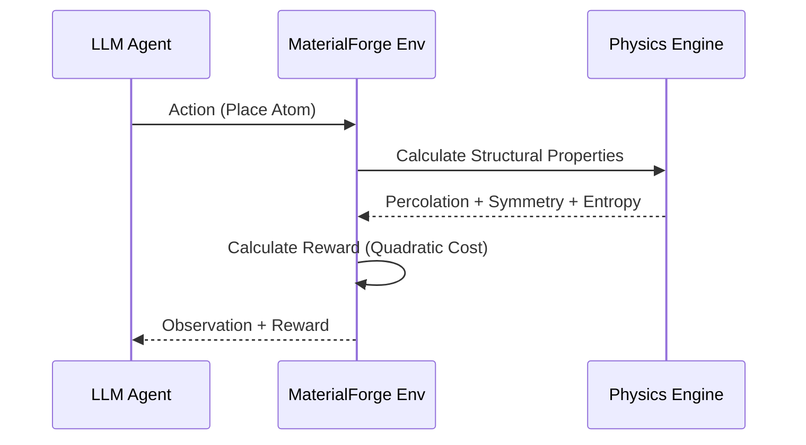

<div align="center">
  
  <h1>🔬 MaterialForge</h1>
  <h3>AI-Driven Atomic Crystal Structure Engineering</h3>
  <p><i>Building the future of materials discovery through advanced reinforcement learning.</i></p>

[](https://github.com/meta-pytorch/openenv)
[](LICENSE)
[](https://openenv.ai)

</div>

---

## 🏗️ Project Overview

**MaterialForge** is a high-fidelity Reinforcement Learning environment designed for the discovery and optimization of atomic crystal structures. Unlike simple grid-worlds, MaterialForge implements complex scientific heuristics that simulate the physical properties of real-world materials.

### 🚀 Key Innovations

- **Advanced Physics Simulation:** Professional-grade heuristics using **Percolation Thresholds** for conductivity and **Gibbs-Stability** for structural integrity.
- **Structural regularities:** Measures **Positional Entropy** and **Point-group Symmetry** to evaluate lattice order.
- **Scientific Telemetry:** A custom laboratory dashboard providing deep analytics into crystalline growth.

---

## 🧪 Scientific Architecture

MaterialForge goes beyond simple placement. It simulates the **Structure-Function relationship** using three core scientific pillars:

### 1. The Physics Pipeline



### 2. Atomic Species Data

| Symbol | Element Type  | Role            | Hardness | Conductivity | Thermal | Cost |
| :----- | :------------ | :-------------- | :------- | :----------- | :------ | :--- |
| **A**  | **Metal**     | Structural Core | 0.9      | 0.4          | 0.2     | 8    |
| **B**  | **Conductor** | Signal Sync     | 0.2      | 0.9          | 0.1     | 6    |
| **C**  | **Ceramic**   | Thermal Plate   | 0.6      | 0.1          | 0.9     | 4    |
| **P**  | **Polymer**   | Elastic Linker  | 0.1      | 0.2          | 0.3     | 2    |

---

## 📊 Environment Workflow

The environment follows a standard Reinforcement Learning loop, optimized for large-scale evaluation via OpenEnv.



---

## 🏆 Scoring & Rubric

The grading logic is designed to reward both **Scientific Accuracy** and **Material Efficiency**.

### Reward Formula

$$R = (\alpha \cdot S_{stability} + \beta \cdot L_{order} + \gamma \cdot P_{accuracy}) - \text{Cost}_{quadratic}$$

| Metric              | Scientific Basis                       | Weighting |
| :------------------ | :------------------------------------- | :-------- |
| **Stability Index** | Mirror symmetry & coordination bonding | 30%       |
| **Order Index**     | Homogeneity & sub-lattice entropy      | 20%       |
| **Property Delta**  | L2-norm distance to target vector      | 40%       |
| **Efficiency**      | Quadratic penalty for budget overruns  | 10%       |

---

## 🛠️ Getting Started

### Prerequisites

- Python 3.10+
- [uv](https://docs.astral.sh/uv/) (Recommended)

### Quick Launch

```bash
# Clone
git clone https://github.com/Arsh-Pathan/MaterialForge && cd MaterialForge

# Initialize & Run
uv run server
```

### Inference Test

```bash
export API_BASE_URL="http://your-proxy"
export API_KEY="your-key"
export MODEL_NAME="your-model"

uv run python inference.py
```

---

<div align="center">
  <p>Developed with ❤️ for the <b>Meta PyTorch OpenEnv Hackathon</b></p>
  <a href="https://huggingface.co/spaces/ArshPathan/material_forge_env"><b>View Live Lab Demo</b></a>
</div>
