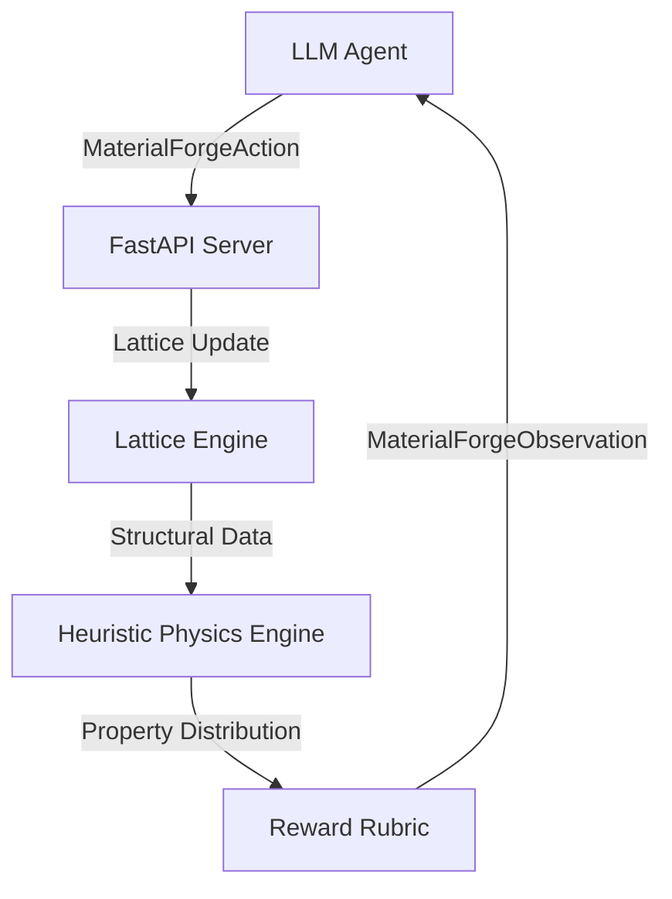

# 🔬 MaterialForge
### AI-Driven Atomic Crystal Structure Engineering

[](https://github.com/meta-pytorch/openenv)
[](LICENSE)
[](https://openenv.ai)

---

**MaterialForge** is a high-fidelity Reinforcement Learning environment designed for the discovery and optimization of atomic crystal structures. It challenges AI agents to arrange atoms on a lattice grid to achieve precise material properties like **Hardness**, **Conductivity**, and **Thermal Resistance**.

## 🚀 Key Features

*   **Atomic Physics Simulation:** Heuristic-based estimation of material properties considering bonding density, symmetry, and structural stability.
*   **Dynamic Lattice Engine:** 8x8 design space supporting complex Phase Classifications (Crystalline vs. Amorphous).
*   **Custom Dashboard:** High-fidelity interactive UI for real-time visualization of agent progress and crystalline growth.
*   **Production Ready:** Fully compatible with Meta's OpenEnv validator and Hugging Face Spaces.

## 🏗️ The Challenge

In materials science, structure defines function. MaterialForge frames this as an iterative optimization task:

1.  **Objective:** Match a target specification (e.g., "Diamond-like" property vector).
2.  **Constraints:** Operate within a finite **Cost Budget** and time-sensitive **Step Limit**.
3.  **Reward:** A complex multi-objective signal balancing structural quality, property accuracy, and material efficiency.

### Atom Palette

| Symbol | Element Type | Role | Cost |
| :--- | :--- | :--- | :--- |
| **A** | **Metal** | High Hardness Provider | 8 |
| **B** | **Conductor** | Signal Efficiency | 6 |
| **C** | **Ceramic** | Thermal Shielding | 4 |
| **P** | **Polymer** | Elasticity & Flexibility | 2 |

## 🛠️ Installation & Setup

### Prerequisites
*   Python 3.10+
*   [uv](https://docs.astral.sh/uv/) (Recommended) or `pip`

### Quick Start
```bash
# Clone and enter directory
git clone https://github.com/Arsh-Pathan/MaterialForge && cd MaterialForge

# Install dependencies and start the environment server
uv sync
uv run server
```

## 🧪 Model Inference

To evaluate an agent against the benchmark locally:

```bash
export API_BASE_URL="http://your-lite-llm-proxy"
export API_KEY="your-key"
export MODEL_NAME="your-model"

uv run python inference.py
```

## 📊 Environment Architecture

MaterialForge is built on the **OpenEnv Core** for robust distributed evaluation.



---

<div align="center">
  <p>Built with ❤️ by <b>Arsh Pathan</b> for the Meta PyTorch OpenEnv Hackathon</p>
  <a href="https://huggingface.co/spaces/ArshPathan/material_forge_env">View Live Demo on Hugging Face</a>
</div>
