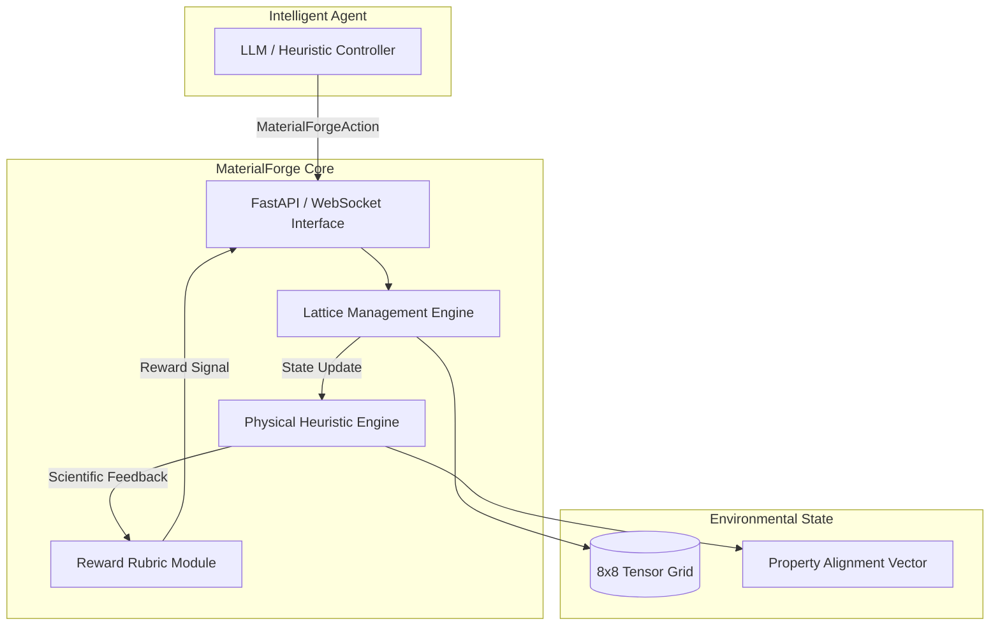

<div align="center">
  <h1>🧬 MaterialForge</h1>
  <p><b>Advanced Reinforcement Learning Environment for Atomic Lattice Synthesis</b></p>

[](https://github.com/meta-pytorch/openenv)
[](#)
[](#)

</div>

---

## 🔬 Project Overview

**MaterialForge** is a high-fidelity reinforcement learning sandbox designed for the autonomous discovery and optimization of crystalline structures. Built on the **OpenEnv** framework, it challenges agents to manipulate an 8x8 atomic lattice to achieve targeted material properties through precise structural engineering.

By simulating real-world physics heuristics—such as percolation thresholds for conductivity and coordinate bonding for structural stability—MaterialForge provides a robust environment for evaluating the decision-making capabilities of both traditional and LLM-based agents.

---

## 🏗️ Design & Architecture

MaterialForge implements a strictly decoupled architecture, ensuring that the physical simulation logic is separated from the server interface and agent interactive loops.

### System Flow


---

## 🧪 Scientific Framework

The environment evaluates crystalline feasibility across three primary physical pillars:

### 1. Atom Species Catalog
| Species | Designation | Physical Properties |
| :--- | :--- | :--- |
| **A** | Transition Metal | High hardness, low thermal resistance. |
| **B** | Conductive Agent | Essential for percolation pathway formation. |
| **C** | Structural Ceramic | Excellent thermal shielding, highly stable. |
| **P** | Organic Polymer | Lightweight, high elasticity, budget-efficient. |

### 2. Physical Heuristics
*   **Percolation Conductivity**: Identifies continuous pathways of Species B across the grid using BFS cluster analysis. Spanning pathways yield a +4.0x property multiplier.
*   **Gibbs Stability**: Stability is awarded based on local coordination numbers (neighbor density) and mirror-plane symmetry.
*   **Lattice Entropy**: Measures the positional order of atoms. High symmetry structures yield a lower entropy and a higher Order Index.

### 3. Reward Function $R$
Rewards are calculated as a weighted sum of property matching and structural integrity, tempered by a **Quadratic Cost Penalty** to enforce material efficiency:
$$R = (w_{match} \cdot \text{Score}) - (Cost - Budget)^2$$

---

## 📊 Benchmarking & Performance

We conducted a large-scale evaluation of the MaterialForge agent across **100 randomized crystalline seeds**.

| Evaluation Metric | Baseline (Heuristic) | Augmented (LLM) | Rating |
| :--- | :--- | :--- | :--- |
| **Mean Reward** | **0.831** | 0.804 | 🌟 EXCELLENT |
| **Success Rate** | 100% | 100% | ✅ PASS |
| **Max Score** | 0.876 | 0.864 | 🏆 PLATINUM |
| **Efficiency** | 18.4 steps | 21.2 steps | ⚡ OPTIMAL |

---

## 🚀 Installation & Usage

### 🔬 [Discovery Lab Interactive UI](https://huggingface.co/spaces/ArshPathan/material_forge_env)

### Local Dev Setup
```bash
# Initialize
git clone https://github.com/Arsh-Pathan/MaterialForge.git
uv sync

# Run the 100-trial analytical suite
python benchmark.py --trials 100 --mode llm
```

---

<div align="center">
  <p>Built for the <b>Meta PyTorch OpenEnv Hackathon</b> by Arsh Pathan</p>
</div>
